# Azure Data Factory Mapping Data Flows Hands-on Lab

## Introduction

Azure Data Factory (ADF) is a hybrid ETL service, designed to ease the construction of complex data integrations pipelines. Mapping Data Flows, a feature of ADF, is designed to enable graphical construction of data transformation pipelines, at scale, using the Azure Databricks Spark engine, without the need for any hand coding or Spark knowledge.

This hands-on lab will demonstrate the capabilities of ADF and Mapping Data Flow by using a sample template that introduces several Data Flow features. This lab will also implement a complex real-world data pipeline scenario that utilizes some of the template features.

## Prerequisites 

Before starting this lab, you will need the following prerequisites:

1.  An Azure Account that you have create rights in

    1.  You will need to create your own resource group for this lab

2.  An Azure Data Factory, created in the West US geographical region

    1.  It is important that this is created in West US, otherwise the Mapping
        Data Flow feature will not be available

    2.  Create in the resource group that you created above

    3.  For the purposes of this lab, do not enable GIT integration

3.  An Azure storage account, also in the West US geographical region

    1.  Create in the resource group that you created above

    2.  Create a BLOB container for the sample data. Make sure the container is
        named *demo*

    3.  Download all of the files located here:
        <https://github.com/kromerm/adfdataflowdocs/tree/master/sampledata>

    4.  If you have git installed, you can simply clone the *adfdataflowdocs*
        repository to your local machine. If not, you can download a ZIP file
        containing all of the resources.

    5.  Upload all sample files to the BLOB container that you created above

4.  An Azure SQL Database

    1.  Create a new database specifically for this lab

    2.  Ensure that you know the SA password

    3.  Ensure that you have SQL tools, such as Management Studio available

Once the prerequisites are created, you are ready to begin the lab.

## Exercise 1 – Deploying Data Flow Templates

In this exercise, you will deploy a new pipeline by using a template. The
template will create example data flows that implement several data
transformation capabilities that explain how Mapping Data Flow works to easily
transform data.

1.  In the Azure Portal, browse to the Data Factory that you created above and
    select the *Author and Monitor* link:

    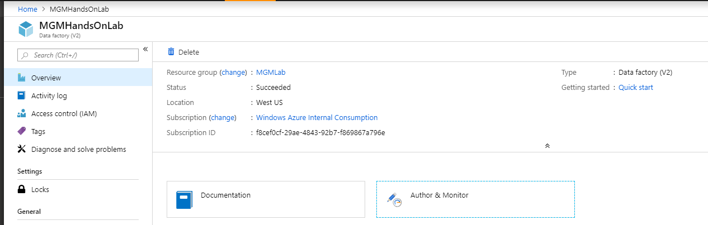

2.  This will open the ADF Getting Started page:

    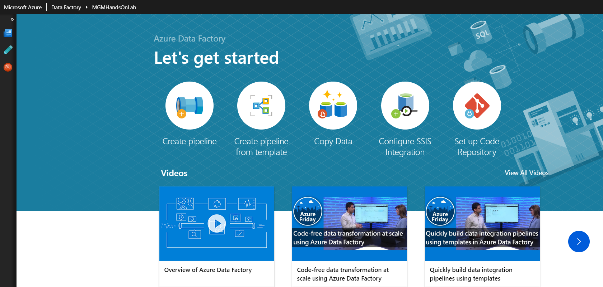

3.  Click on *Create pipeline from template*:

    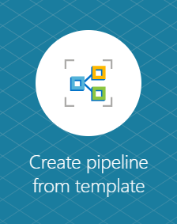

4.  Choose the Data Flow tab

    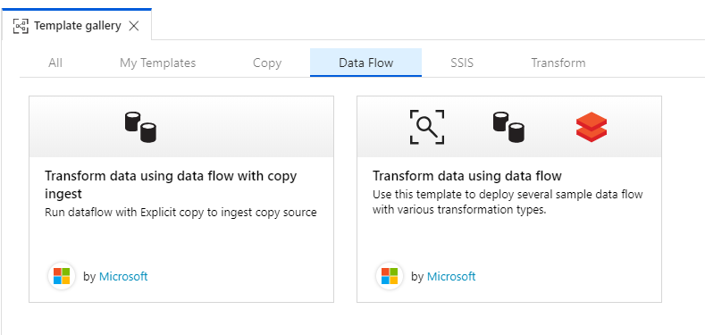

5.  Choose Transform data using data flow

    1.  This will deploy a new pipeline with several file attachments

    2.  Select the *CADOutput* user input, then select the Source Blob
        Connection drop down, and select New. This will open the New Linked
        Service dialog

        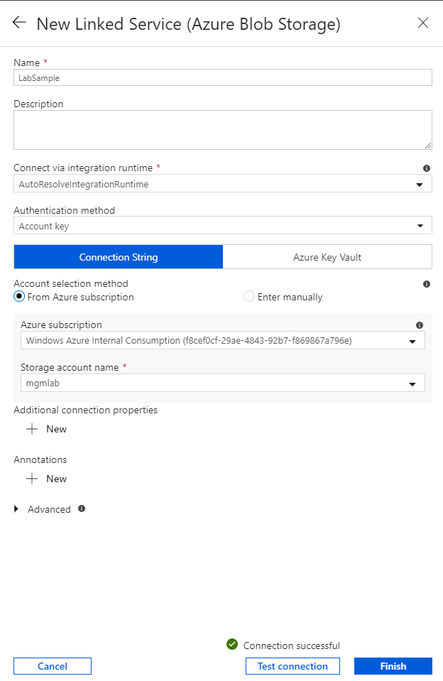

    3.  Fill out the form with the storage account information that you selected
        above and then select *Test connection* to verify. Once the verify is
        successful, select Finish to create the Linked Service. This will return
        you to the previous page with all Blob connections properly filled out.

        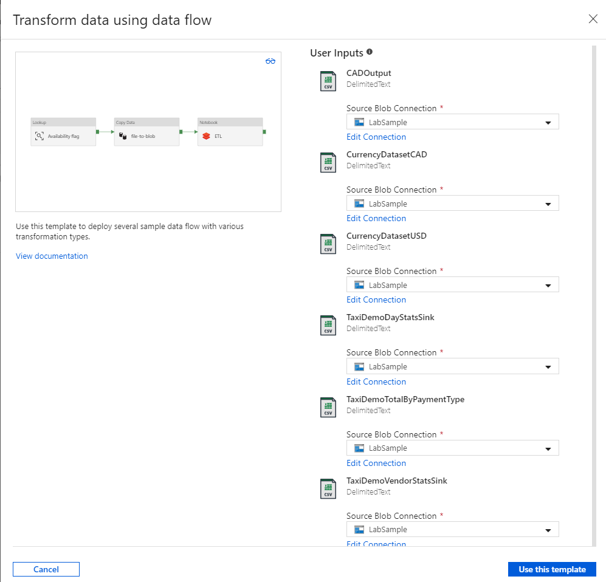

    4.  Click Use this template to deploy the template.

        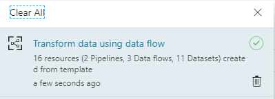

    5.  This will create 2 pipelines, 3 Data Flows, and 11 Datasets

        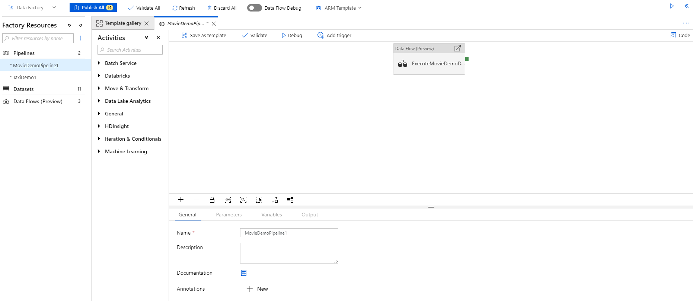
        
*** NOTE
***Once you have imported your Data Flows and Pipelines from the template, you should switch into "Data Flow Debug" mode. Switch on the debug session with the "Data Flow Debug" button on the top of the browser design surface. The initial start-up time for debug sessions will take about 5-6 minutes. Once the cluster indicator light turns green, you can iteratively work with your data in the data flow. The debug session will keep a cluster alive for you until the TTL expires or you turn off your debug session.

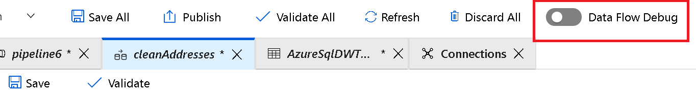

6.  Select the Data Flows tab on the left side, and then select the MovieDemo1
    Data Flow. This will open the Data Flow editor and display 3 components:

    

7.  Select Movies, and explore the Source Settings:

    

    1.  The Source dataset is *movie_dataflow_source1*, which is a text file
        stored in the blob account that you created earlier. Click *Edit* and
        view the properties of the dataset

        

    2.  Click the *Connection* tab then click *Preview data* to view the first few rows of the dataset

        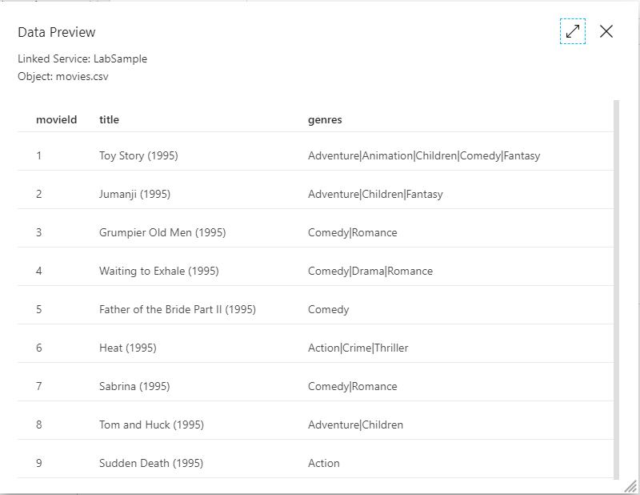

    3.  Click the *Schema* tab, and then select *Import schema* and select *From
        connection/store*

        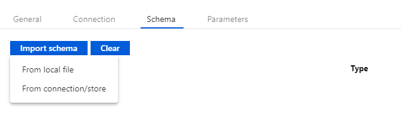

    4.  This will load the schema directly from the file

        

    5.  The schema matches the preview and displays 3 columns of Type String.

8.  Click on the *MovieDemo1* tab, and then select *Source Options*

    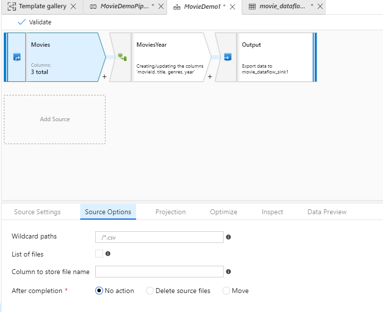

    1.  *Wildcard paths* allow you to process all source files matching the wildcard path.
    
    2. *List of files* checkbox allows you to point to a text file that lists each file path you wish to process. This option is particularly helpful in situations where the specific files to process aren't easily addressed with a wildcard.
    
    3. *Column to store filename* allows you to create a new column name in the source data stream that defines the source file name and path. This option is particularly useful for capturing lineage information in the data flow.
    
    4. *After completion* radio button allows you to define the action to take on the source files onced they have been processed. This allows you to automate deleting or moving
    the source files once the process is complete.

9.  Select the *Projection* tab

    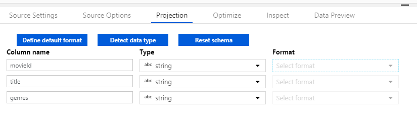

    1.  This is where you can perform simple data transformation or formatting
        (like date/time or currency)

    2.  For this case, the Projection matches the schema of the source file

10. Select the *Optimize* tab

    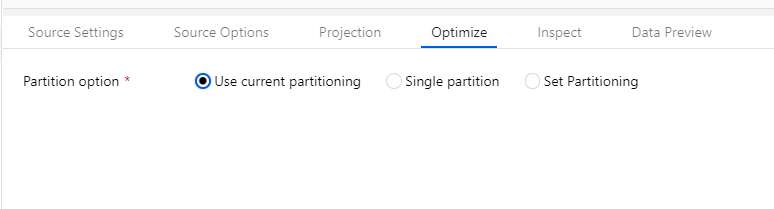

    1.  This is useful when you have large source files and need to partition
        accordingly

    2.  In this case, the current partitioning is sufficient since the file is
        relatively small

11. Select the *Inspect* tab

    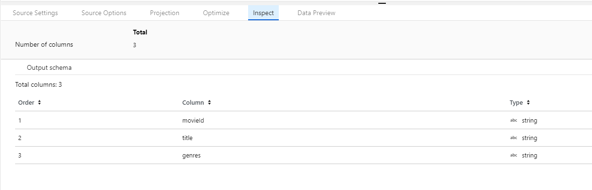

    1.  This shows the output schema with the column order, name, and datatype

12. Select the *Data Preview* tab

    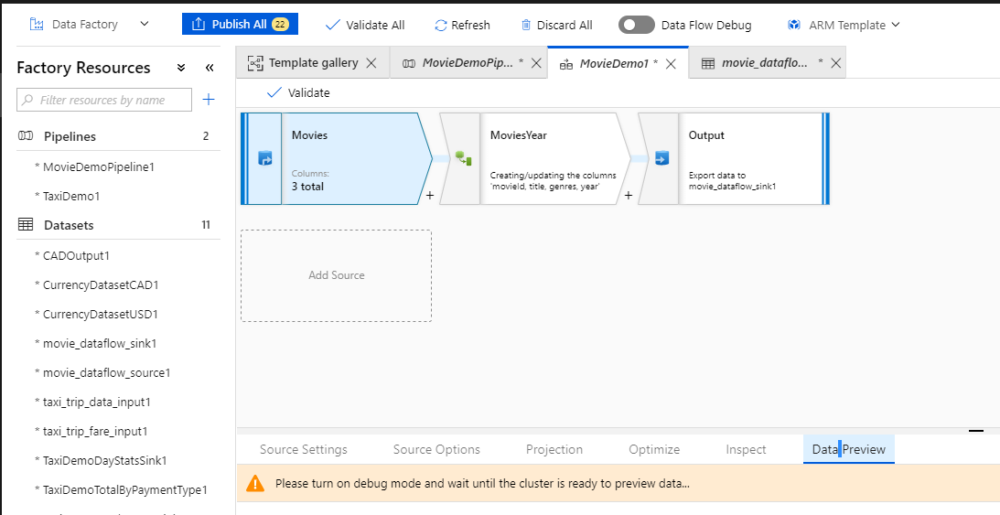

    1.  Enable Debug mode by sliding the Data Flow Debug button at the top of
        the screen to the right

        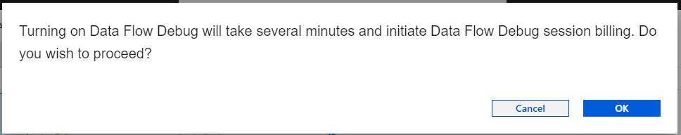

    2.  Click *OK* to provision the Databricks environment to execute the data
        flow. This will take several minutes to complete

    3.  Once the cluster is ready (monitor the notifications icon in the upper
        right) click the *Data Preview* tab again, and then click *Fetch Latest
        Preview*

        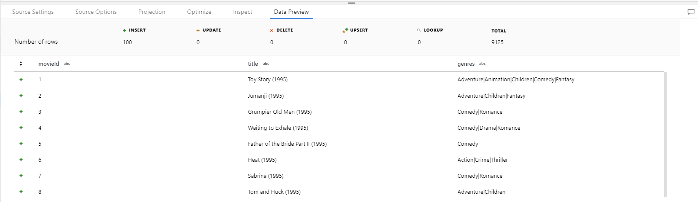

    4.  Note the format of the data in the title column. In the next section you
        will use a derived column object to extract the Year of the movie.

NOTE: No data is written to the sink datasets during debug sessions in the Data Flow designer. In order to output data and write to the destination, you must execute your Data Flow as an activity inside a pipeline. You can test the data flow as part of an end-to-end test from a pipeline using the pipeline Debug button.

### Transform Data with Data Flow Expressions

1.  Examine the *Derived Columns Settings*, and note the function being used to
    extract the year and the title. (In this example, year is an integer value
    that is extracted by trimming the parenthesis from the rightmost 6
    characters, and the title is everything else)

2.  Click the *Data Preview* (and wait for the cluster to start again if it has
    stopped) and click Fetch Latest Preview

    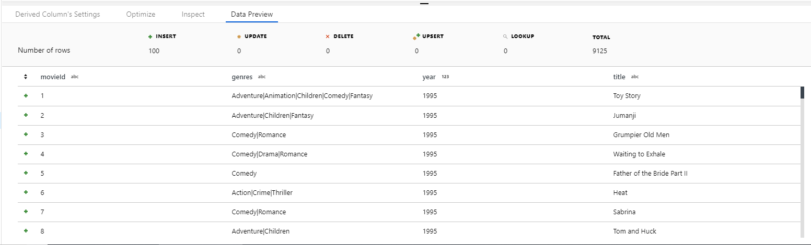

3.  The dataset now contains the additional year and title columns

4.  Click the Output object

    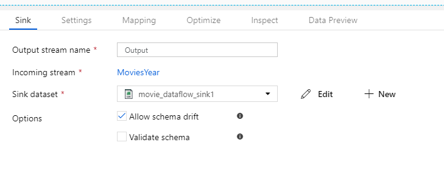

    1.  Note that the Sink dataset is *movie_dataflow_sink1*. Click Edit and
        note the sink is a delimited text file

        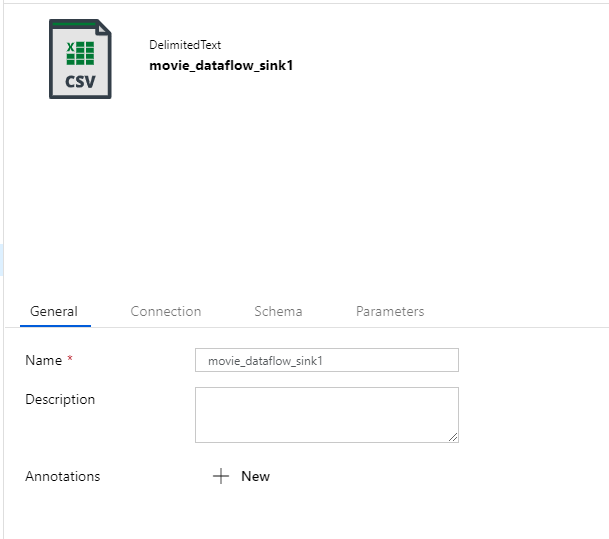

    2.  Click the *Connection* tab. Notice that there is no filename associated
        with the sink. This will be generated at runtime.

        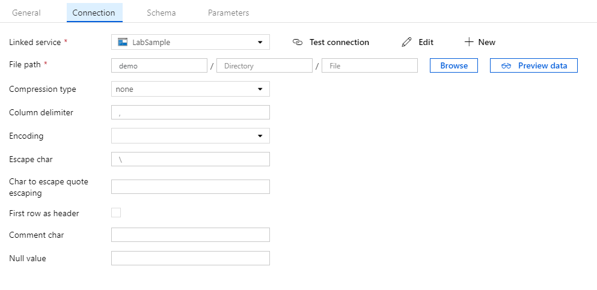

    3.  Note that the output file will be a text file with comma delimiters and
        a backslash for the escape character

5.  Click on the *MovieDemo1* tab to return to the Output object, and then click
    the *Mapping* tab to verify that the data mappings are correct

    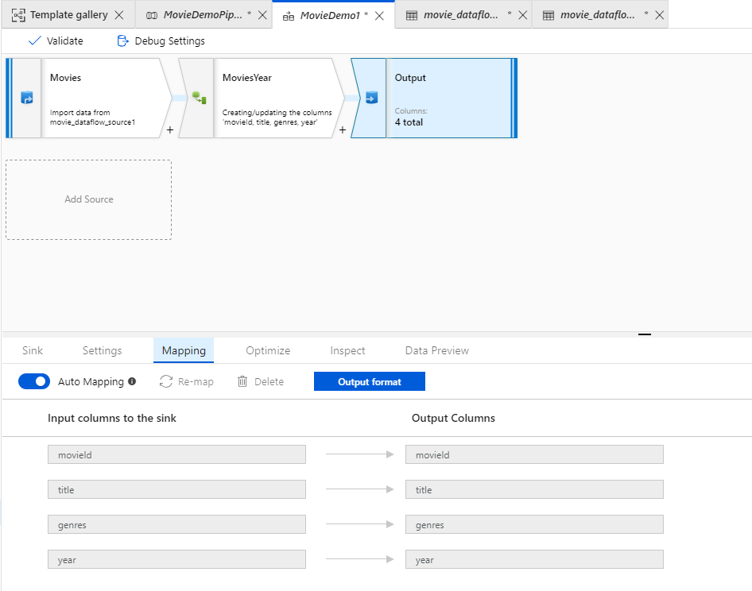

6.  Click on the *Data Preview* tab, and then click *Fetch latest preview data*
    to view the data

    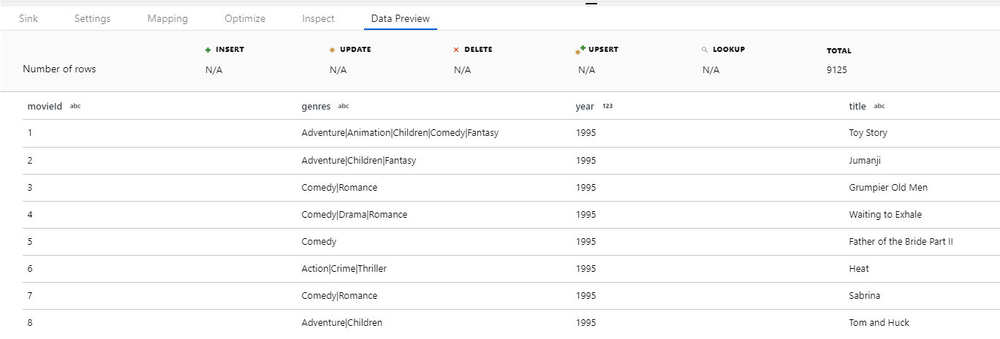
    
### Test the Data Flow in a Pipeline for End-to-End Execution

Executing the Data Flow from the Data Flow design surface in debug mode does not output any data nor does it write to a database. The Sink is essentially ignored. In order to test your data flow end-to-end, you'll debug the pipeline from the ADF pipeline UI and then use the Debug button from the pipeline. Make sure that you have switched on the "Data Flow Debug" toggle switch so that pipeline debug can use an active warm cluster for debugging.
    
1.  Click on the *MovieDemoPipeline* tab to return to the pipeline. Notice that
    there is only one object, which is the Data Flow Execution object. This
    simply is an orchestration container to execute the Data Flow that we just
    examined

    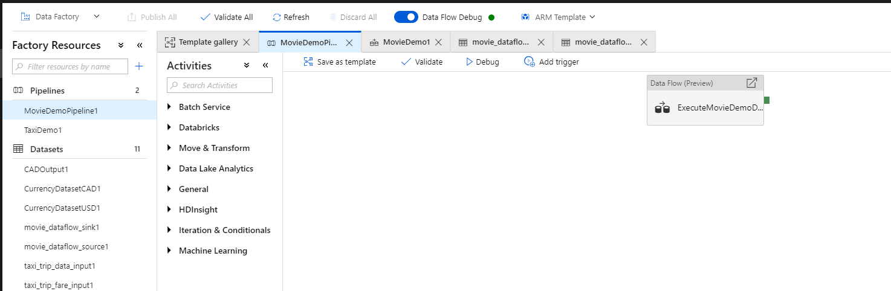

2.  Select *Debug* to execute the pipeline. This will open the execution monitor
    in debug mode

    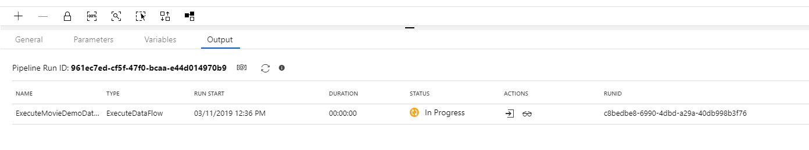

    1.  Click the eyeglass icon in the *Actions* column to view detail of the
        execution (You may have to refresh the pipeline run to see results)

        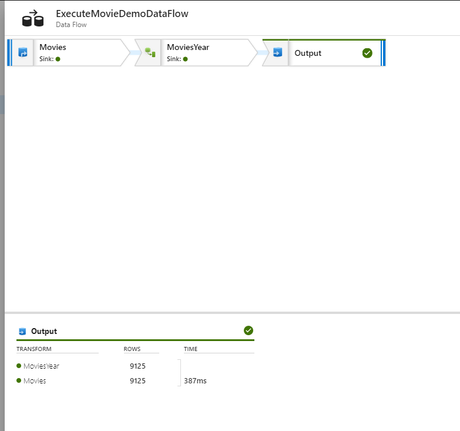

    2.  Once the execution completes, you will see results such as the above

3. To view the contents of the output file, use either Azure Storage Explorer,
    or the Azure Portal to view the contents of the storage container that you
    created earlier. You will note that there are new files in the container.
    Select the file that begins with part-00000 and select View/Edit Blob from
    the context menu. This will open the editor and display the contents of the
    file.

    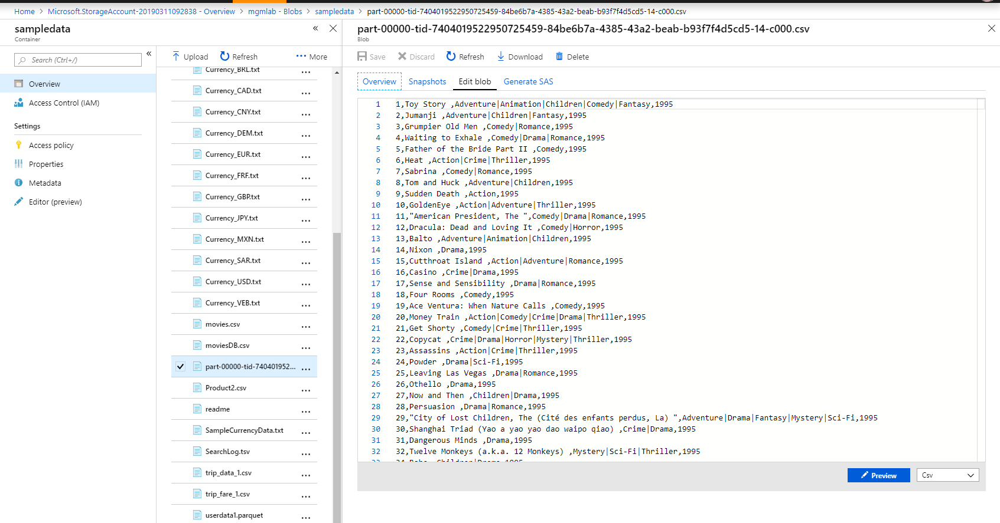

In this exercise, you deployed a new Azure Data Factory Mapping Data Flow by
using a template. You then walked through a simple Data Flow that read data from
a text file, transformed the data by splitting a column into multiple columns,
and then output the data to a new text file.

Clean up the environment by closing all of the tabs in the Data Factory Window

## Exercise 2 – Examining a Complex Data Flow

In this exercise, you will examine a complex data flow that uses joins and
aggregations to transform data. The dataset used in this example is from the New
York City Taxi and Limousine Commission, and provides data related to trips and
charges. A full description of the dataset can be found here:
<https://www1.nyc.gov/site/tlc/about/tlc-trip-record-data.page>

1.  In the Azure Data Factory UI, select the *TaxiDemo1* Data Flow (you may have
    to resize the bottom portion of the screen to view the entire Data Flow)

    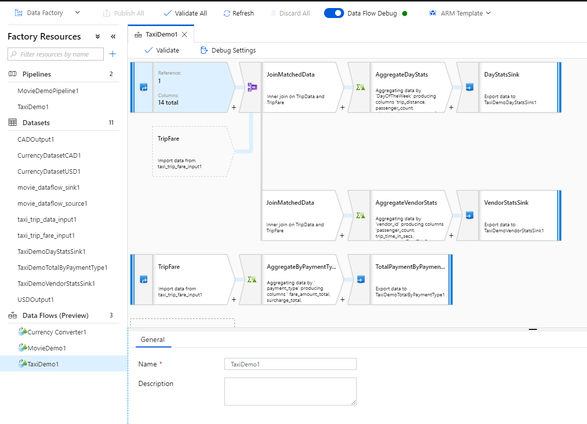

2.  Select the *TripData* object and view the *Source Settings.* Examine each of
    the tabs, including the *Data Preview*, by using the same technique you used
    in the previous exercise (do NOT import the schema however as this will
    break downstream objects at this point)

    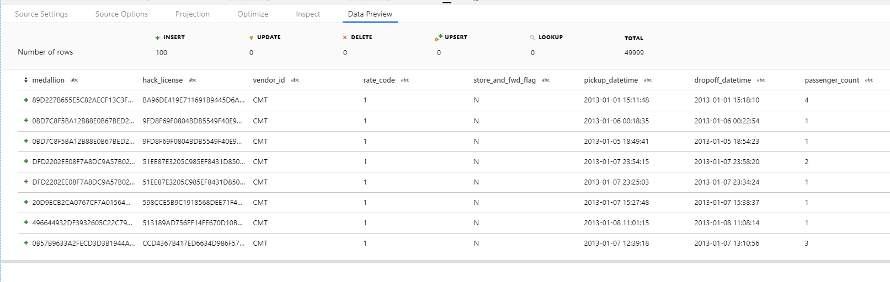

3.  Select the *TripFare* object that is connected to the *JoinMatchedData*
    object and view the *Source Settings*. Examine each of the tabs including
    the *Data Preview*

    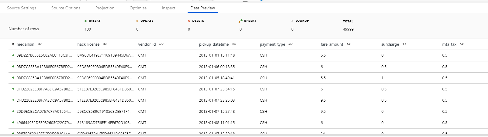

4.  Select the JoinMatchedData object. Note how the two datasets are joined.

    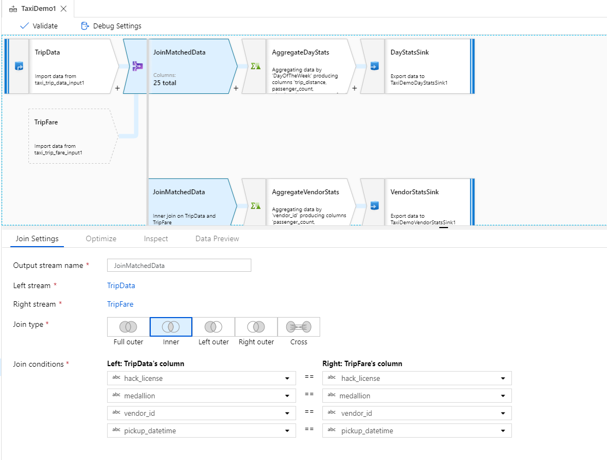

    1.  This will join the data where each of the above columns match.

5.  Click the *Data Preview* tab and *Fetch latest preview data* to view the
    results of the join

    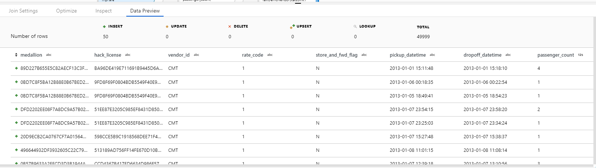

6.  Click the *AggregateDayStats* object and note the group by formula

    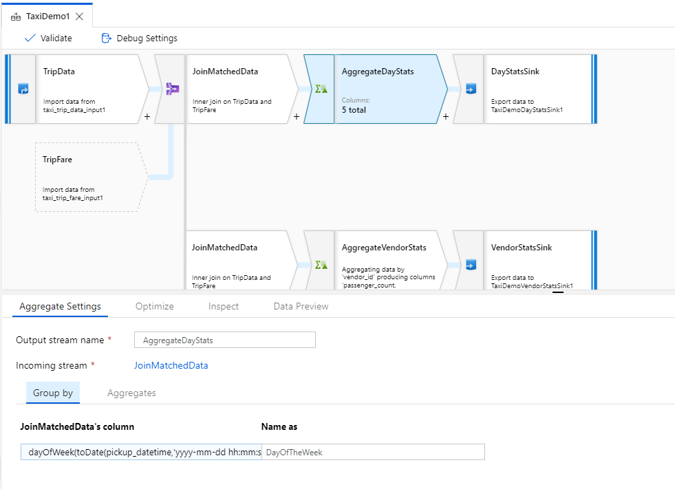

    1.  This will group the output by the calculated day of the week, derived
        from the *pickup_datetime* column.

7.  Click the *Aggregates* tab and note the calculations that will be performed
    on the data

    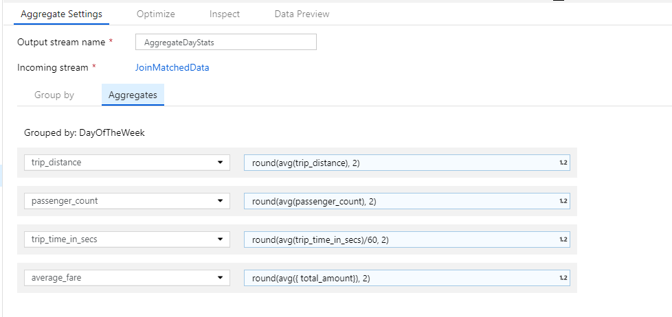

    1.  This will create average values for each of the columns specified,
        grouped by the calculated day of the week

8.  Click the *Data Preview* tab and *Fetch latest preview data* to view the
    results

    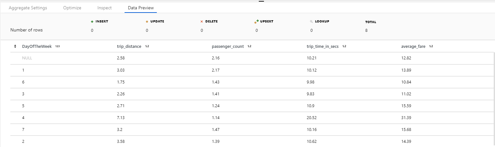

9.  Click the *AggregateVendorStats* object, note that the grouping will be by
    *vendor_id*

    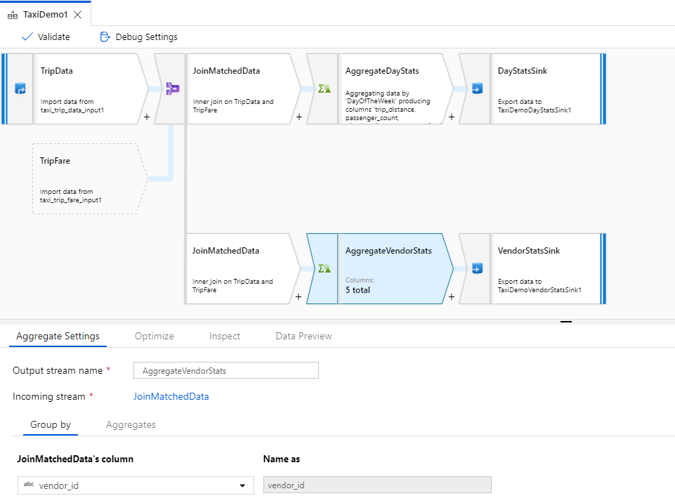

10. Click the *Aggregates* tab and note the calculated values

    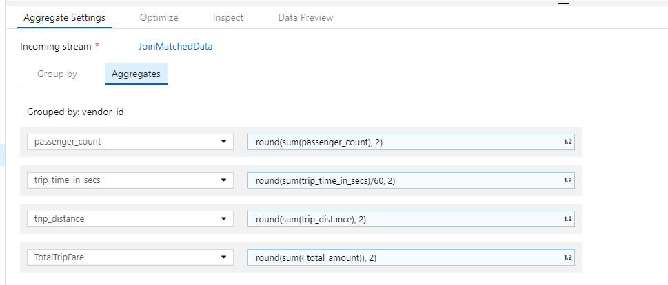

    1.  This will create average values based on the columns shown, grouped by
        *vendor_id*

11. Click the *Data Preview* tab and *Fetch latest preview data*

    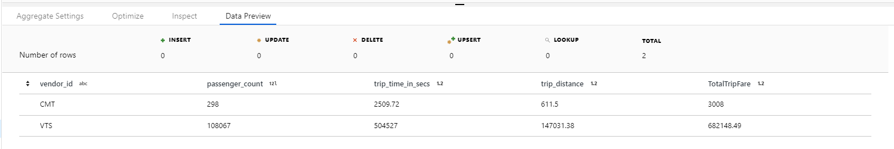

12. Click the lower *TripFare* object and note the various configuration
    options. Preview the data to view the dataset

    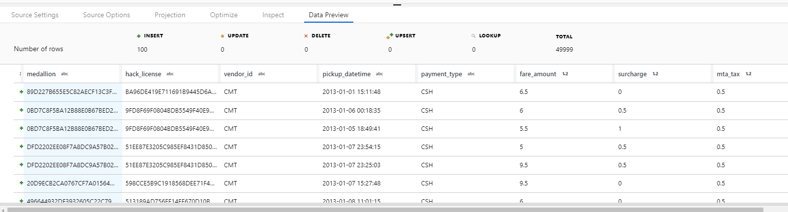

13. Click the *AggregateByPaymentType* object and note that the data is grouped
    by the payment_type column

    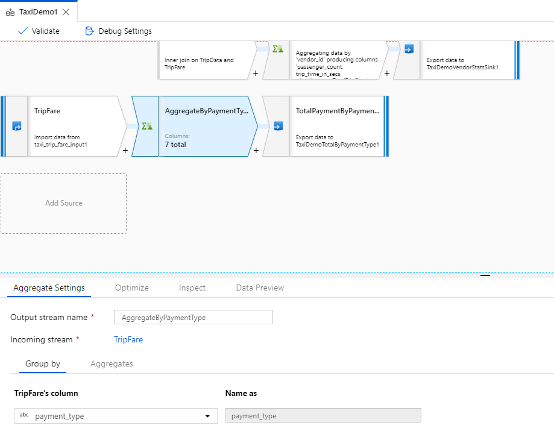

    1.  Click the *Aggregates* tab and note the formula used for the
        calculations

        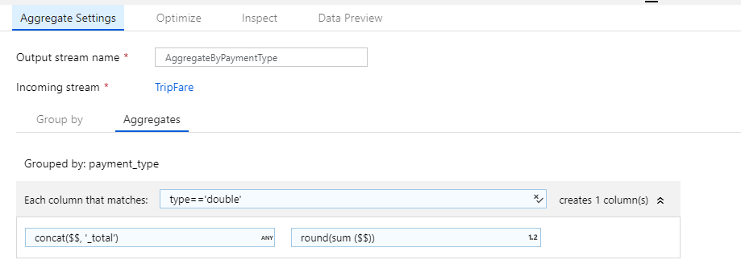

    2.  This formula calculates the SUM of each column in the source data that
        is of double datatype and then names the column the original name plus
        \_total

    3.  Click the *Data Preview* tab to view the results of the aggregation

        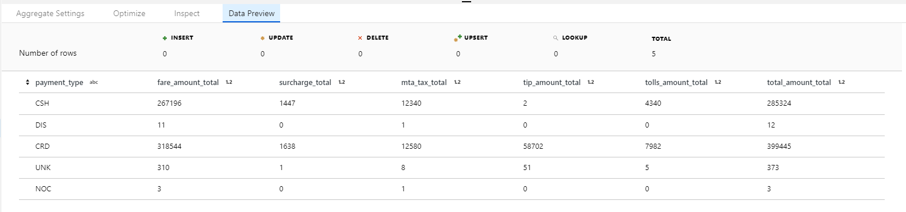

14. When the Data Flow is executed, the output will be 3 files containing
    statistics by day of week and by vendor, as well as total payments by type

15. Click on the *TaxiDemo1* pipeline and click Debug to execute the pipeline.
    Use the details (the eyeglasses) icon to view the transformation details.

    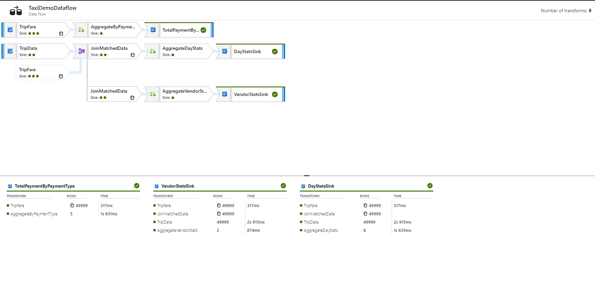

In this exercise you examined a complex data flow that used joins and
aggregations to create output files. You then executed the data pipeline in
debug mode to view the results.

Before moving to the next exercise, clean up the Data Factory UI by closing all
tabs and returning to the blank canvas.

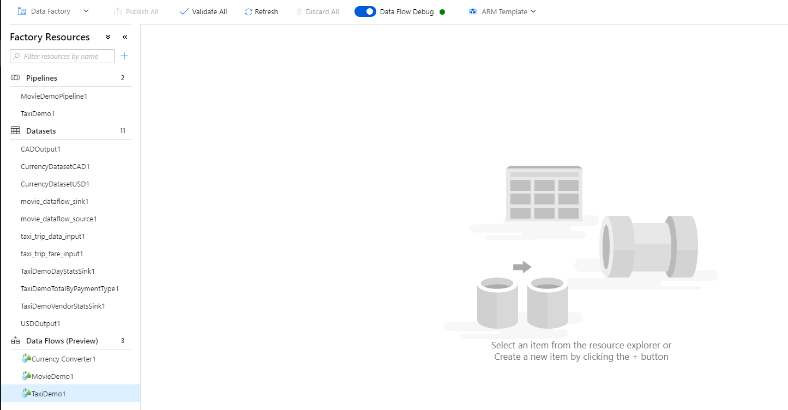

## Exercise 3

In previous exercises you used a pre-constructed Pipeline and Data Flow in order
to view concepts that are used to construct Data Flows. These Data Flows were
examples that simply read from a file and output to a file. In this exercise,
you will create a Pipeline and Data Flow from “scratch” that is designed to
implement a specific business scenario that will read data from a web service
(using the SODA protocol, which is a generic http web service), transform the
data, and output to an Azure SQL Database instance.

### The Scenario

The City of Chicago publishes data for each police report that is filed within
the city. This data is made available via a web service connection.

In this exercise you will construct a new data flow that extracts the
information from the web service, enhances it with additional data, create
aggregations, and sink the data to an SQL Database. You will also monitor and
debug the pipeline and learn how portions of a pipeline can be re-executed in
the event of failure.

1.  In the *Data Factory UI*, click the ellipse (…) to the right of Pipelines
    and select *Add Pipeline*. Name the new pipeline *CrimeDataPipe*

    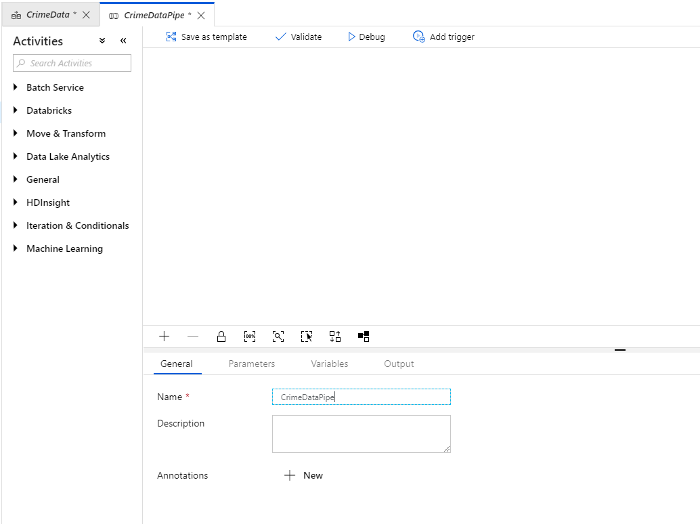

2.  From the *Move & Transform* section on the left, drag a *Copy Data* object
    onto the canvas and name it *CopyCrimeData*

    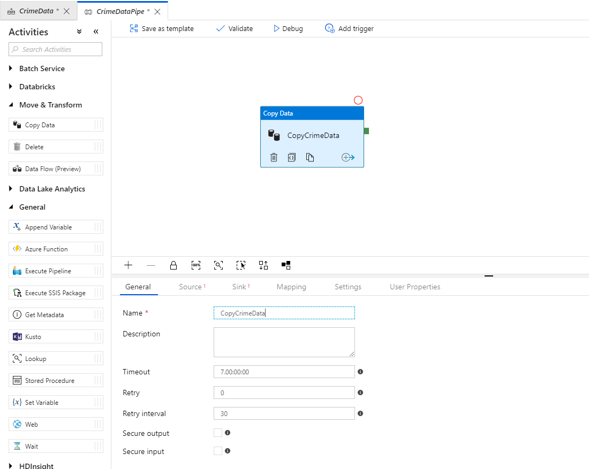

3.  Select the *Source* tab, then click *New* to create a new source. Search for
    *http* in the list and click *Finish*

    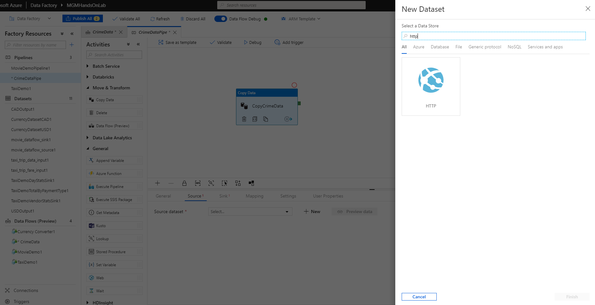

4.  Name the source *SODACrimeAPI* (You will be connecting to an API using the
    SODA protocol)

    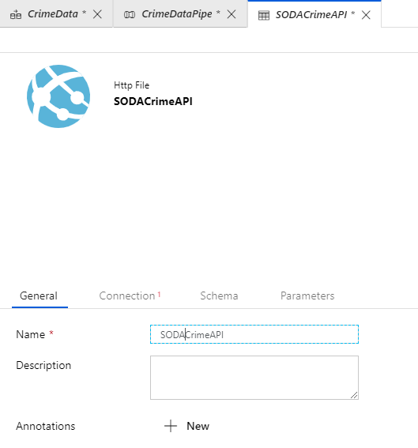

5.  Click the *Connection* tab and create a new Linked Service. Name the Linked
    Service *ChicagoCrime*. Use
    <https://data.cityofchicago.org/resource/crimes.json?$limit=50000> as the
    *Base URL* and select *Anonymous* for the *Authentication type*

    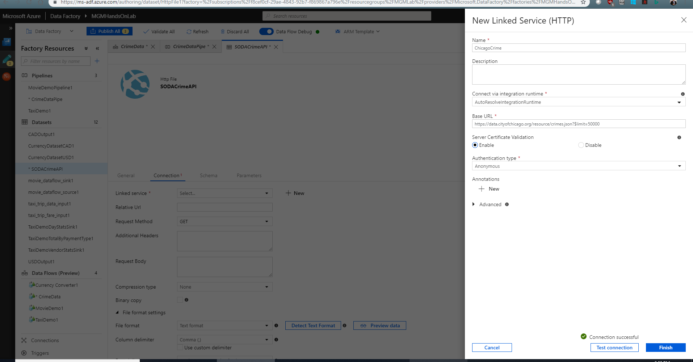

6.  Click *Test connection* to verify that you have the correct URL, and then
    click *Finish* to create the new Linked service.

7.  Select *JSON format* for the File format, and *Array of objects* for the
    file pattern

    

8.  Click *Preview data* to view a preview of the data

    

9.  Click the *Schema* tab and then click *Import schema*

    

10. Select the *CrimeDataPipe* tab, select the **Sink** tab, then select **New
    Dataset**. Click on *Azure Blob Storage*, and click *Finish*

    

11. This will open a new *Blob Storage* connection tab. Name the connection
    *ChicagoCrimesFile*

    

12. Click the *Connection* tab and select *LabSample* in the *Linked Service*
    drop down. Click the *Browse* button and select the *outputs* folder that
    you created as part of the prerequisites. Enter *ChicagoCrimes.csv* as the
    filename

    

13. Select Text format, check Column names in the first row, and type a double
    quote (“) in the Quote character under Advanced settings

    

14. Click *Publish All* to publish all changes, and then close all tabs except
    the *CrimeDataPipe* tab

15. In the CrimeDataPipe tab, click Debug to begin execution of the Pipeline and
    create the output file

    

16. Verify that the file exists by using either Azure Storage explorer, or the
    Azure Portal to browse to the outputs container

    

    1.  The previous steps were necessary to create the input file which will be
        used for the remaining steps in this exercise

17. In the *Data Factory UI*, click the ellipse (…) to the right of Data Flows
    and select *Add Data Flow.* Name the new Data Flow *CrimeData*

    

18. Click *Add Source* and name the Output stream *CrimeDataFile*

    

19. Click *New* next to *Source dataset* to create a new dataset connection and
    select *Delimited Text*

    

20. Select *Finish* and in the *New Dataset* dialog, enter *ChicagoCrimeFile* as
    the name, select *LabSample* as the Linked service, click *Browse* and
    browse to the file created above. Select *First row as header* to complete
    the Dataset configuration.

    

21. Click *Finish* to create the new dataset.

    

22. On the *Data Preview* tab, select *Fetch latest data preview* (wait for the
    cluster to start if it has timed out)

    

23. In the Data Flows UI, click the + next to the *CrimeData* object, and select
    *Derived Column*

    

24. In the *Derived Columns Settings*, enter *ExtractDateTime* for the name, and
    in the Columns section, name the first column *Date*, and use the function
    *left(date,10)*. Add a new column (click the + to the right of the function)
    and name the second column *Time*. Use the function *right(date,8)*

    

25. Click the *Data Preview* tab and select *Fetch latest preview data*

    

    1.  Note that you will not see the new columns as the preview only displays
        a sample of the columns

26. In the *Data Flow UI*, click the + next to the *DateTimeExtract* object and
    select *Aggregate*. Name the Aggregate *DayOfWeekCount* and in the column
    field, select Derived column. Use
    dayOfWeek(toDate(DateTimeExtract\@Date,'yyyy-mm-dd')) as the derived column

    

27. Name the column *DayOfWeek* and then select the Aggregates tab. Select the
    iucr column and for the aggregate function enter count(iucr)

    

28. Click the Data Preview tab and then click Fetch latest preview data to
    validate the results

    

    1.  This is just a simple example of how to use a function against a derived
        column to calculate an aggregation.

29. In the *Data Flows UI*, select the **+** symbol to the right of the
    *DateTimeExtract* object and select *New Branch*

    

30. Select the + symbol to the right of the new DateTimeExtract object and
    select Filter from the menu (you will have to scroll down)

    

31. Name the new object Only2016 and in the Filter Settings, use
    year(toDate(DateTimeExtract\@Date))==2016 as the filter

    

32. Select the *Data Preview* tab and *Fetch latest preview data*

    

    1.  Note that the rows have been properly filtered to only include 2016 data

33. In the Data Flow UI, select the + to the right of the Only2016 object and
    select Sink (you will have to scroll to the bottom)

    

34. Name the new object *SQLDatabase* and select *New* to the right of *Sink
    dataset*, then select *Azure SQL Database*. Select *Finish*

    

35. In the *New Linked Service* dialog, select *New* and fill out the details
    using the SQL Database that you created as part of the prerequisites to this
    lab.

    

36. Click *Test connection*, and then *Finish* once the connection is
    successful.

    

37. In the *New Dataset* dialog, check the *Edit* box, and use *2016CrimeData*
    as the table name. Select *None* in the *Import schema* radio button

38. In the SQLDatabase object, select the Mapping tab and turn off Auto Mapping.
    Rename the original date column to OldDate

    

39. Select the Data Preview tab and then Fetch latest preview data

    

    1.  Note the renamed date column

    2.  The Data Flow is now ready to execute

40. In the Data Factory UI, select the *CrimeDataPipe* tab, and drag a *Data
    Flow* object onto the canvas to the right of the *CopyCrimeData* object
    already present

    

41. Select the *CrimeData* Data Flow in the drop down menu, and select *Finish*

    

42. Using the mouse, click the green box on the right of the CopyCrimeData
    object and drag it to the CrimeData Data Flow object.

    

43. The pipeline is now created. The first step will contact the web service and
    create the CrimeData text file, and then when that successfully completes,
    the Data Flow you just created will execute

44. Click *Publish All* to save all changes

45. Click *Debug* to start the execution of the pipeline

    

    1.  Monitor the execution of the pipeline by clicking the details
        (eyeglasses) icon

        

        

In this exercise, you used knowledge from the first two exercises to create a
Data Flow that extracts data from a web service in JSON format, transform the
data, and load it into a SQL Database instance.
